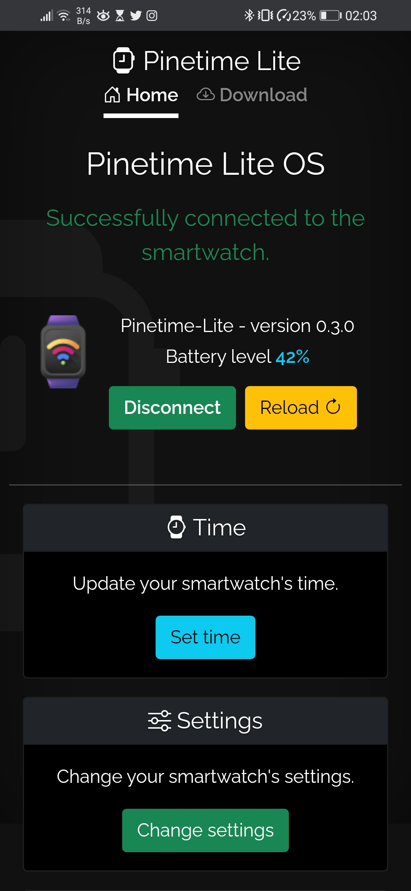

# Pinetime Lite OS - Web Companion app for version 0.3.0

View Live https://home.joaquim.org/pinetime





#### On some Android phones this error may appear, they must use the "Reload" button for the application to try to recharge the services again, it usually resolves the errors.


## Project setup
```
npm install
```
### Compiles and hot-reloads for development
```
npm run serve
```
### Compiles and minifies for production
```
npm run build
```
